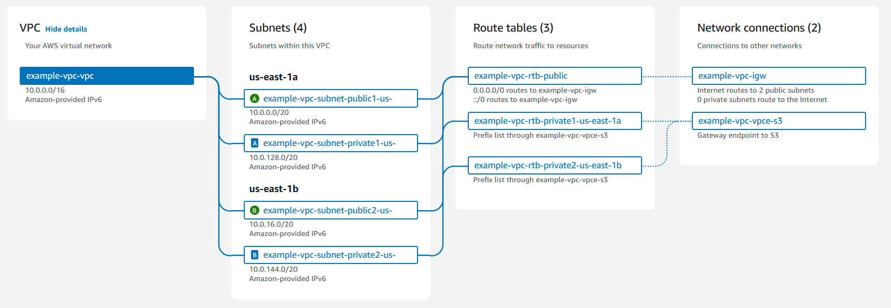

# VPC

## Ref:
<https://aws.amazon.com/pt/vpc/>\
<https://docs.aws.amazon.com/pt_br/vpc/?icmpid=docs_homepage_featuredsvcs>\
<https://docs.aws.amazon.com/pt_br/vpc/latest/userguide/how-it-works.html>

O Amazon Virtual Private Cloud (Amazon VPC) oferece controle total sobre seu ambiente de redes virtual, incluindo posicionamento de recursos, conectividade e segurança. Comece a usar configurando sua VPC no console de serviço AWS. Em seguida, adicione recursos a ela, como instâncias do Amazon Elastic Compute Cloud (EC2) e Amazon Relational Database Service (RDS). Por fim, defina como suas VPCs se comunicam entre si, entre contas, zonas de disponibilidade (AZs) ou Regiões da AWS. 

## Custo

<https://aws.amazon.com/pt/vpc/pricing/>

Não há custo adicional por usar a VPC. Porém, alguns componentes da VPC são cobrados, como os gateways NAT, o Gerenciador de Endereços IP, o espelhamento de tráfego, o Analisador de Acessibilidade e o Analisador de Acesso à Rede.

## Componentes Principais

- VPC
- Sub-redes
- Tabela de Rotas
- Internet Gateway
- NAT Gateway
- Elastic IP 
- Security Groups

## VPC

A VPC é uma rede virtual muito semelhante a uma rede tradicional que você pode operar no seu próprio data center. Após criar uma VPC, você pode adicionar sub-redes.

## Sub-rede

Uma sub-rede consiste em um intervalo de endereços IP na VPC. Cada sub-rede fica alocada em uma única zona de disponibilidade. Após adicionar as sub-redes, você pode implantar os recursos da AWS na VPC.

## Tabela de Rotas

<https://docs.aws.amazon.com/pt_br/vpc/latest/userguide/VPC_Route_Tables.html>

Use tabela de rotas para direcionar o trafego da sub-rede ou do Gateway.

## Internet Gateway

<https://docs.aws.amazon.com/pt_br/vpc/latest/userguide/VPC_Internet_Gateway.html>

Um gateway da Internet é um componente da VPC horizontalmente dimensionado, redundante e altamente disponível que permite a comunicação entre a VPC e a Internet. Ele oferece suporte para tráfego IPv4 e IPv6. Não causa riscos de disponibilidade ou restrições de largura de banda no tráfego de rede.

## NAT Gateway

<https://docs.aws.amazon.com/pt_br/vpc/latest/userguide/vpc-nat-gateway.html>

Um gateway NAT é um serviço de Network Address Translation (NAT – Conversão de endereços de rede). Você pode usar um gateway NAT para que as instâncias em uma sub-rede privada possam se conectar a serviços fora da VPC, mas os serviços externos não podem iniciar uma conexão com essas instâncias.

## Elastic IP

<https://docs.aws.amazon.com/pt_br/AWSEC2/latest/UserGuide/elastic-ip-addresses-eip.html>

Um Endereço IP elástico é um endereço IPv4 estático projetado para computação em nuvem dinâmica. Um endereço IP elástico é alocado para a conta da AWS e será seu até que você o libere. Com um endereço IP elástico, é possível mascarar a falha de uma instância ou software remapeando rapidamente o endereço para outra instância na conta. Como alternativa, é possível especificar o endereço IP elástico em um registro DNS para o seu domínio, para que ele acione a sua instância. 

Você aloca um Elastic IP para sua conta e o associa à instância ou a uma interface de rede.

## Security Groups

<https://docs.aws.amazon.com/pt_br/AWSEC2/latest/UserGuide/ec2-security-groups.html>

Um grupo de segurança atua como firewall virtual para as instâncias do EC2 visando controlar o tráfego de entrada e de saída. As regras de entrada controlam o tráfego de entrada para a instância e as regras de saída controlam o tráfego de saída da instância. Ao executar sua instância, é possível especificar um ou mais grupos de segurança. Se você não especificar um grupo de segurança, o Amazon EC2 usará o grupo de segurança padrão para a VPC. 

## Terraform
